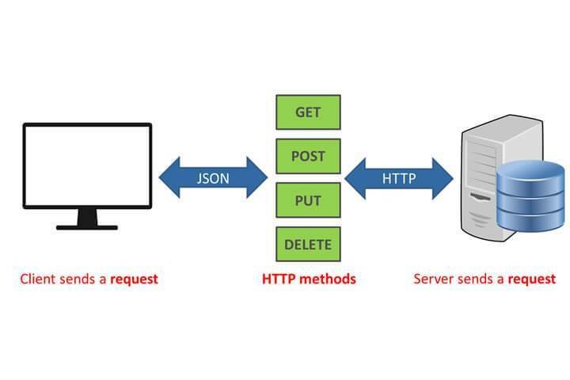
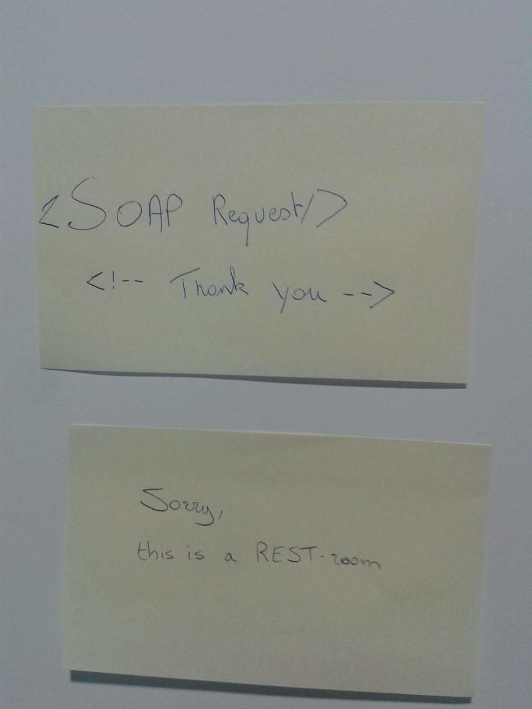
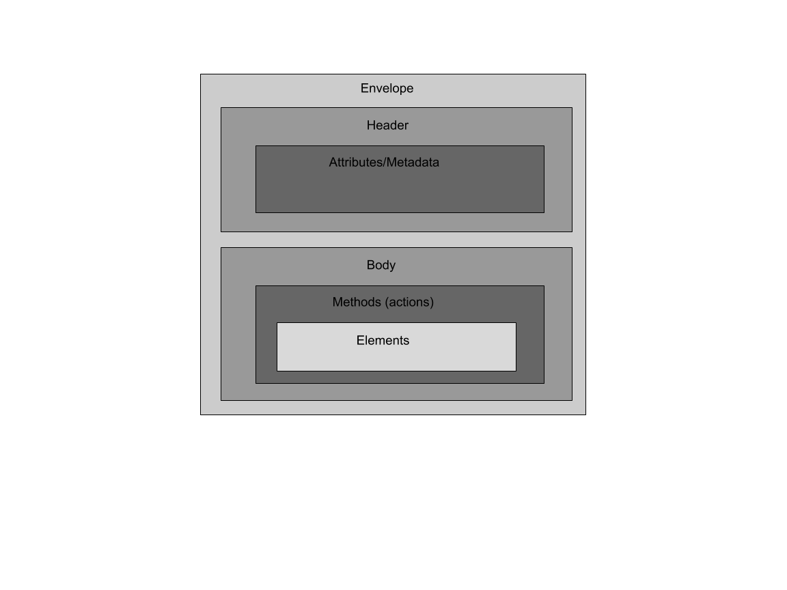
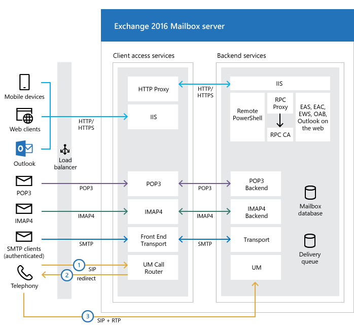
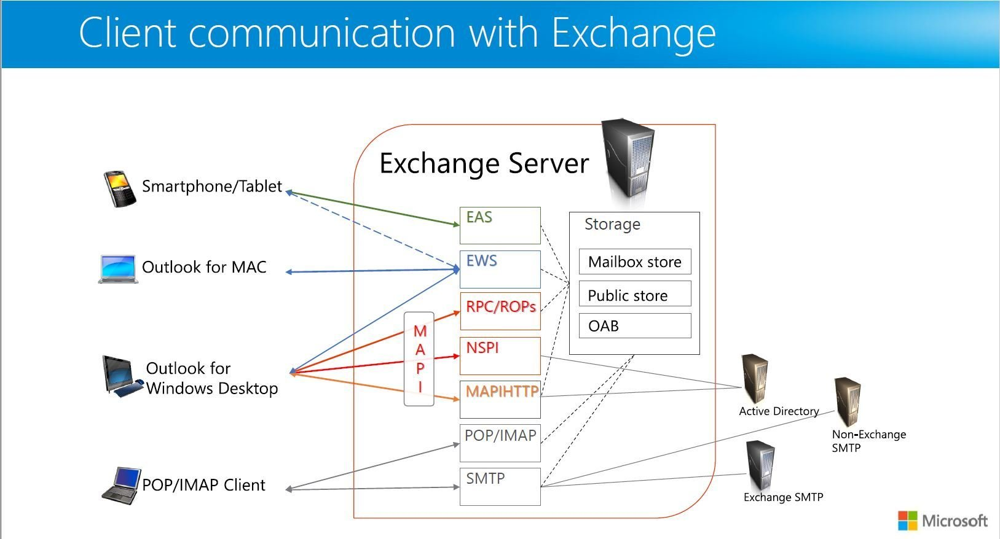
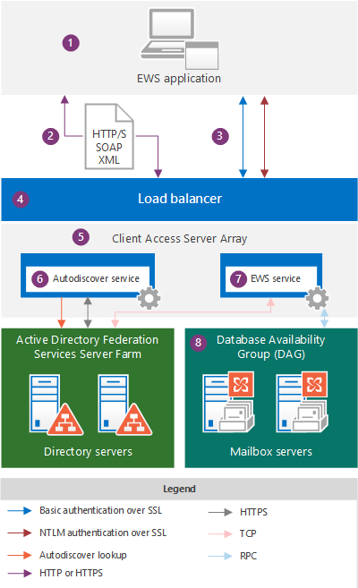
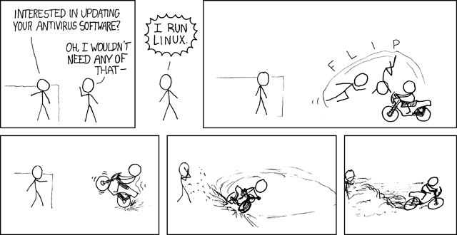
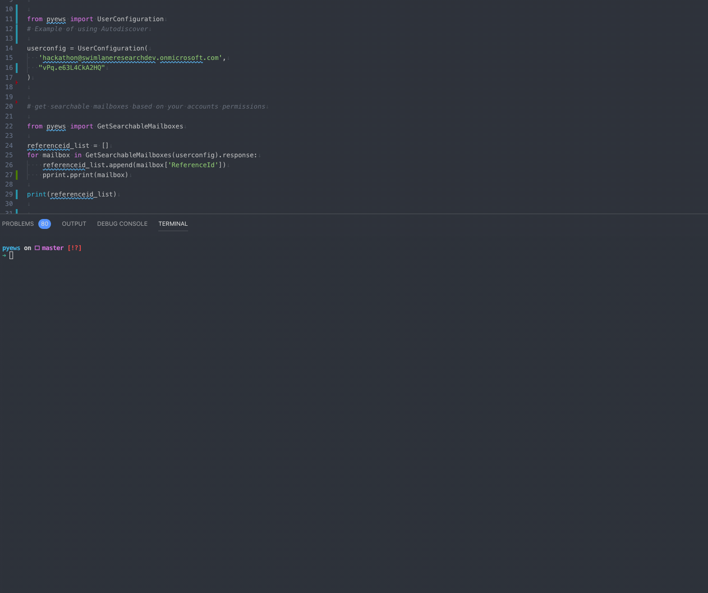
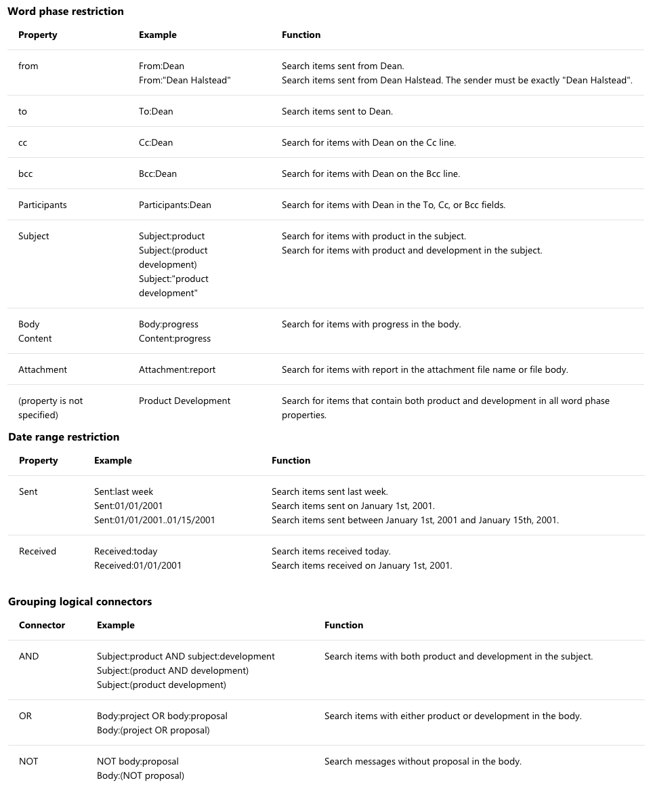
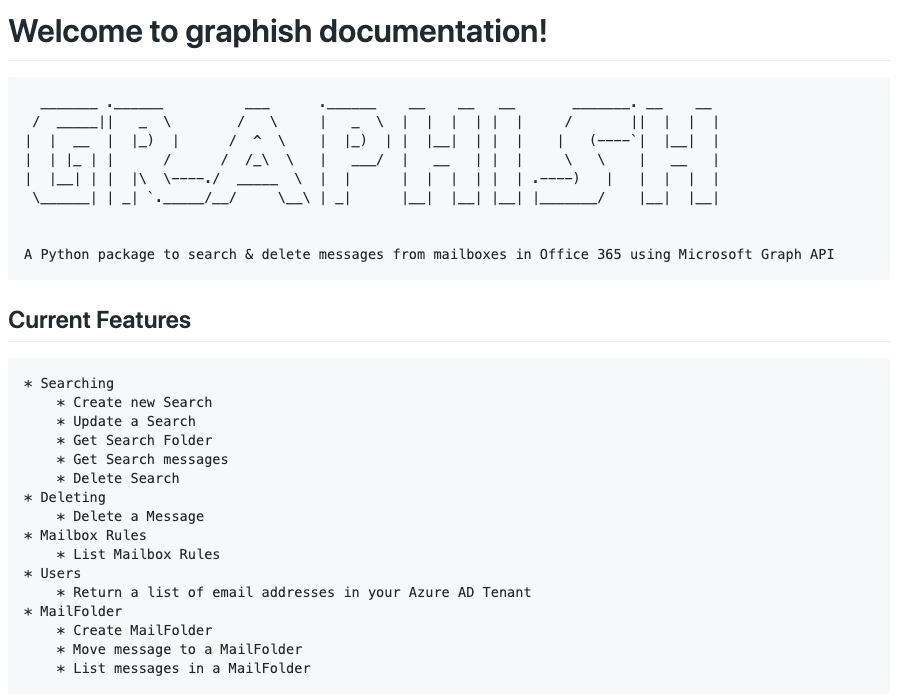

<br>
<br>
<br>
<br>
<br>
<br>
<br>
<br>
<br>
<br>
<br>
<br>
<br>
<br>
<br>
<br>
<br>
<br>
<br>
<br>
<br>
<br>
<br>
<br>
<br>

<center><h1>py-ews</h1></center>

<center><h2>A cross platform python pacakge to interact with Exchange Web Servicese</h2></center>

</center>

<br>
<br>
<br>
<br>
<br>
<br>
<br>
<br>
<br>
<br>
<br>
<br>
<br>
<br>
<br>
<br>
<br>
<br>
<br>
<br>
<br>
<br>
<br>
<br>
<br>

# About Me


<div>
    <div style="text-align: right"><h1>Josh Rickard</br>
                                        @MSAdministrator</h1>
    <h2><ul>
        <li>Blue Team</li>
        <li>DFIR</li>
        <li>Automate All the Things</li>
        <li>Open Sorcerer</li>
    </ul></h2>
</div>
</div>
    <br>
<br>
<br>
<br>
<br>
<br>
<br>
<br>
<br>
<br>
<br><br>
<br>
<br>
<br>
<br>
<br>
<br>
<br>
<br>
<br>
<br><br>
<br>
<br>
<br>
<br>
<br>
<br>
<br>
<br>
<br>
<h2>I like long walks through binary trees, #Python & #PowerShell riding, holding hands with Microsoft, writing romantic experiences about code, git prune all the branches, and deep sea #phishing</h2>
<br>
<br>
<br>
<br>
<br>

<br>
<br>
<br>
<br>
<br>
<br>
<br>
<br>
<br>
<br>
<br>
<br>
<br>
<br>
<br>
<br>

# REST VS. SOAP


<br>
<br>
<br>
<br>
<br>
<br>
<br>
<br>
<br>
<br>
<br>
<br>
<br>
<br>
<br><br>
<br>
<br>
<br>
<br>
<br>
<br>
<br>
<br>
<br>
<br>
<br>
<br>
<br>
<br><br>
<br>
<br>
<br>
<br>
<br>
<br>
<br>
<br>
<br>
<br>
<br>
<br>
<br>
<br>

# REST (Representable State Transfer)




<br>
<br><br>
<br>
<br>
<br>
<br>
<br>
<br>
<br>
<br>
<br>
<br>
<br>
<br>
<br>
<br>
<br>
<br>
<br><br>
<br>
<br>
<br>
<br>
<br>
<br>
<br>
<br>
<br>
<br>
<br>
<br>
<br>
<br>

# SOAP (Simple Object Access Protocol)




<br>
<br>
<br>
<br>
<br>
<br>
<br>
<br>
<br>
<br>
<br>
<br>
<br>
<br>
<br>
<br>
<br>
<br>
<br>
<br>
<br>
<br>
<br>
<br>
<br>
<br>
<br>
<br>
<br>
<br>
<br>
<br>
<br>
<br>
<br>
<br>
<br>
<br>
<br>
<br>




<div>
   <h1><b>POST ONLY</b></br></h1>
   <h2>No matter if you are intending to GET, POST, PUT, etc.
   <h2>YOU WILL ALWAYS <b>POST</b> DATA</h2>
</div>

<br>
<br>
<br>
<br>
<br>
<br>
<br>
<br>
<br>
<br>
<br>
<br>
<br>
<br>
<br>
<br>
<br>
<br>
<br>
<br>
<br>
<br>
<br>
<br>
<br>
<br>
<br>
<br>
<br>
<br>
<br>
<br>
<br>
<br>
<br>


#

<center><h1>Exchange</h1></center>
    <div>
        
    </div>
    <div>
        
    </div>
</div>
<br>
<br>
<br>
<br>
<br>
<br>
<br>
<br>
<br>
<br>
<br>
<br>
<br>
<br>
<br>
<br>
<br>
<br>
<br>
<br>
<br>
<br>
<br>
<br>
<br>
<br>
<br>
<br>
<br>
<br>
<br>
<br>
<br>
<br>
<br>

#

<div>
<center><h1>Exchange Web Services</h1></center>
    <div>
        
    </div>
    <div>
        <h1>HTTP/S SOAP XML Service</br>
        </br>
        Basically, central access to all services/features of Microsoft Exchange
    </div>

</div>

<br>
<br>
<br><br>
<br>
<br>
<br>
<br>
<br>
<br>
<br>
<br>
<br>
<br>
<br>
<br>
<br>
<br>
<br>
<br><br>
<br>
<br>
<br>
<br>
<br>
<br>
<br>
<br>
<br>
<br>
<br>
<br>
<br>
<br>
<br>
<br>
<br><br>
<br>
<br>
<br>
<br>
<br>
<br>
<br>
<br>
<br>
<br>
<br>
<br>
<br>
<br>
<br>
<br><br>
<br>
<br>
<br>
<br>
<br>
<br>
<br>
<br>
<br>
<br>
<br>
<br>
<br>
<br>

# Ways to Connect to Exchange

* # **.NET/C# using EWS Managed API**
* # **PowerShell/C#/JS/Node/etc. through REST API (O365 only)**
* # **PowerShell using Microsoft.Exchange.WebServices.dll**
* # **PowerShell (PS) Remote Session to Exchange Online (O365 only)**
* # **PowerShell Remoting to JumpBox or Exchange Server directly**
* # **PowerShell Exchange CmdLet's (Windows Only)**

<br>
<br>
<br>
<br>
<br>
<br>
<br>
<br>
<br>
<br><br>
<br>
<br>
<br>
<br>
<br>
<br>
<br>
<br>
<br>
<br>
<br>
<br>
<br>
<br>
<br>
<br><br>
<br>
<br>
<br>
<br>
<br>
<br>
<br>
<br>
<br>
<br>
<br>
<br>
<br>
<br>

# What about *nix Users?




<br>
<br>
<br>
<br>
<br>
<br>
<br>
<br>
<br>
<br><br>
<br>
<br>
<br>
<br>
<br>
<br>
<br>
<br>
<br>
<br>
<br>
<br>
<br>
<br>
<br>
<br><br>
<br>
<br>
<br>
<br>
<br>
<br>
<br>
<br>
<br>
<br>
<br>
<br>
<br>
<br>

# py-ews

# Welcome to py-ews's documentation!


```

    .______   ____    ____       ___________    __    ____   _______.
    |   _  \  \   \  /   /      |   ____\   \  /  \  /   /  /       |
    |  |_)  |  \   \/   / ______|  |__   \   \/    \/   /  |   (----`
    |   ___/    \_    _/ |______|   __|   \            /    \   \    
    |  |          |  |          |  |____   \    /\    / .----)   |   
    | _|          |__|          |_______|   \__/  \__/  |_______/    
                                                                 


    A Python package to interact with Exchange Web Services
```


# **py-ews** is a cross platform python package to interact with both Exchange 2010 to 2019 on-premises and Exchange Online (Office 365).  This package will wrap all Exchange Web Service endpoints, but currently is focused on providing eDiscovery endpoints. 

<br>
<br>
<br>
<br>
<br>
<br>
<br>

# Repository: https://github.com/swimlane/pyews
# Documentation: https://py-ews.readthedocs.io/en/latest/


<br>
<br>
<br>
<br>
<br>
<br>
<br>
<br>
<br>
<br><br>
<br>
<br>
<br>
<br>
<br>
<br>
<br>
<br>
<br>
<br>
<br>
<br>
<br>
<br>
<br>
<br><br>
<br>
<br>
<br>
<br>
<br>
<br>
<br>
<br>
<br>
<br>
<br>
<br>
<br>
<br>

# Versions

## py-ews works with 2.7+ and 3.X versions of Python

# Installation

> Python's standard package manager is pip which uses packages from pypi

## OS X & Linux:

```
pip install py-ews
```

## Windows:

```
pip install py-ews
```

## GitHub

### You can also clone from GitHub directly:

```
git clone git@github.com:swimlane/pyews.git
cd ./pyews
python setup.py install
```


# Usage

## To use py-ews you must first import py-ews into your python script/session

```python
from pyews import UserConfiguration
```

<br>
<br>
<br>
<br>
<br>
<br>
<br>
<br>
<br>
<br>
<br>
<br>
<br>
<br>
<br>
<br>
<br>
<br>


# UserConfiguration Object

<br>
<br>
<br>

# This is used to connect to all Service Endpoints

<br>
<br>
<br>
<br>
<br>
<br>
<br>
<br>
<br>
<br>
<br>
<br>
<br>
<br>
<br>
<br>
<br>
<br>

# UserConfiguration object will be used for all calls to Exchange Web Services

## UserConfiguration object

```python
from pyews import UserConfiguration
```

## You have several options when it comes to authentication to EWS

# eDiscovery or Compliance Rights

## The most common is using an accounts username and password which has one of the following rights within your Exchange environment:

* ## **eDiscovery Rights**
* ## **Compliance Administrator**
* ## **eDiscovery Manager**
* ## **eDiscovery Administrator**
* ## **Organization Management**

```python
from pyews import UserConfiguraton

userconfig = UserConfiguration(
   'l337hacker@funtimes.onmicrosoft.com',
   'Password1234!'
)
```

<br>
<br>
<br>
<br>
<br>
<br>
<br>
<br>
<br>
<br>
<br>
<br>
<br>
<br>
<br>
<br>
<br>
<br>

# Impersonation Rights

> ## Impersonation means you can act on behalf of a user/mailbox

* ## **ApplicationImpersonation** or **ms-exch-impersonation** must be given to the mailboxes/accounts that you have rights to impersonate

```python
from pyews import Impersonation
from pyews import UserConfiguraton

my_impersonation = Impersonation(principalname='first.last@company.com')
#Impersonation(primarysmtpaddress='first.last@company.com')
#Impersonation(smtpaddress='first.last@company.com')


userconfig = UserConfiguration(
   'l337hacker@funtimes.onmicrosoft.com',
   'Password1234!',
   impersonation=my_impersonation
)
```
<br>
<br>
<br>
<br>
<br>
<br>
<br>
<br>
<br>
<br>
<br>
<br>
<br>
<br>
<br>
<br>
<br>
<br>

# Impersonation DeepDive

```python
class Impersonation(object):
    '''The Impersonation class is used when you want to impersonate a user.  You must access rights to impersonate a specific user within your Exchange environment.
    
    Example:
        Below are examples of the data inputs expected for all parameters.
        
        .. code-block:: python

           Impersonation(principalname='first.last@company.com')
           Impersonation(primarysmtpaddress='first.last@company.com')
           Impersonation(smtpaddress='first.last@company.com')

    Args:
        principalname (str, optional): The PrincipalName of the account you want to impersonate
        sid (str, optional): The SID of the account you want to impersonate
        primarysmtpaddress (str, optional): The PrimarySmtpAddress of the account you want to impersonate
        smtpaddress (bool, optional): The SmtpAddress of the account you want to impersonate
    
    Raises:
        AttributeError: This will raise when you call this class but do not provide at least 1 parameter
    '''

    def __init__(self, principalname=None, sid=None, primarysmtpaddress=None, smtpaddress=None):

        if principalname:
            self.impersonation_type = 'PrincipalName'
            self.impersonation_value = principalname
        elif sid:
            self.impersonation_type = 'SID'
            self.impersonation_value = sid
        elif primarysmtpaddress:
            self.impersonation_type = 'PrimarySmtpAddress'
            self.impersonation_value = primarysmtpaddress
        elif smtpaddress:
            self.impersonation_type = 'SmtpAddress'
            self.impersonation_value = smtpaddress
        else:
            raise AttributeError('By setting impersonation to true you must provide either a PrincipalName, SID, PrimarySmtpAddress, or SmtpAddress')

        self.header = self._create_impersonation_header()

    def _create_impersonation_header(self):
        return '''<soap:Header>
  <t:ExchangeImpersonation>
    <t:ConnectingSID>
      <t:{start_type}>{value}</t:{end_type}>
    </t:ConnectingSID>
  </t:ExchangeImpersonation>
</soap:Header>'''.format(start_type=self.impersonation_type, value=self.impersonation_value, end_type=self.impersonation_type)

```

<br>
<br>
<br>
<br>
<br>
<br>
<br>
<br>
<br>
<br>
<br>
<br>
<br>
<br>
<br>
<br>
<br>
<br>

# Autodiscover

## Autodiscover is a service endpoint that is used to determine the Exchange Web Services URL/Endpoint

# Microsoft recommends taking the following approach to discover Autodiscover endpoints

* ## Lookup Service Connection Point (SCP) Objects in Active Directory
* ## Generate potential locations based on the users email address

<br>
<br>
<br>
<br>

# py-ews does not currently utilize SCP objects in Active Directory

> ## py-ews does not do this as it would increase the size of this package significantly

<br>
<br>
<br>
<br>

# py-ews generates a list of potential endpoints based on the provided users email address

## Example: first.last@letsautomate.it

<br>
<br>
<br>
<br>

# By default py-ews will use each of the following URLs to automatically connect you via Autodiscover

```
https://letsautomate.it/autodiscover/autodiscover.svc
https://autodiscover.letsautomate.it/autodiscover/autodiscover.svc
http://letsautomate.it/autodiscover/autodiscover.svc
http://autodiscover.letsautomate.it/autodiscover/autodiscover.svc

https://outlook.office365.com/autodiscover/autodiscover.svc
```


## Example of using Autodiscover

```python
from pyews import UserConfiguration

userconfig = UserConfiguration(
   'l337hacker@funtimes.onmicrosoft.com',
   'Password1234!'
)

# you can print properties on the useconfig object if needed

#print(userconfig.autodiscover)
#print(userconfig.configuration)
#print(userconfig.credentials.password)
#print(userconfig.credentials.email_address)
#print(userconfig.ewsUrl)
#print(userconfig.exchangeVersion)
#print(userconfig.raw_soap)
```
<br>
<br>
<br>
<br>
<br>
<br>
<br>
<br>
<br>
<br>
<br>
<br>
<br>
<br>
<br>
<br>
<br>
<br>
<br>
<br>
<br>
<br>
<br>
<br>
<br>
<br>

# Running UserConfiguration and printing out properties


<br>
<br>
<br>
<br>
<br>
<br>
<br>
<br>
<br>
<br>
<br>
<br>
<br>
<br>
<br>
<br>
<br>
<br>
<br>
<br>
<br>
<br>
<br>
<br>
<br>
<br>
<br>
<br>

# Autodiscover DeepDive

```xml
<?xml version="1.0" encoding="utf-8"?>
<soap:Envelope xmlns:a="http://schemas.microsoft.com/exchange/2010/Autodiscover"      
               xmlns:wsa="http://www.w3.org/2005/08/addressing" 
               xmlns:xsi="http://www.w3.org/2001/XMLSchema-instance"      
               xmlns:soap="http://schemas.xmlsoap.org/soap/envelope/">
  <soap:Header>
    <a:RequestedServerVersion>{version}</a:RequestedServerVersion>
    <wsa:Action>http://schemas.microsoft.com/exchange/2010/Autodiscover/Autodiscover/GetUserSettings</wsa:Action>
    <wsa:To>{to}</wsa:To>
    <t:ExchangeImpersonation>
        <t:ConnectingSID>
            <t:{start_type}>{value}</t:{end_type}>
        </t:ConnectingSID>
    </t:ExchangeImpersonation>
  </soap:Header>
  <soap:Body>
    <a:GetUserSettingsRequestMessage xmlns:a="http://schemas.microsoft.com/exchange/2010/Autodiscover">
      <a:Request>
        <a:Users>
          <a:User>
            <a:Mailbox>{mailbox}</a:Mailbox>
          </a:User>
        </a:Users>
        <a:RequestedSettings>
          <a:Setting>InternalEwsUrl</a:Setting>
          <a:Setting>ExternalEwsUrl</a:Setting>
          <a:Setting>UserDisplayName</a:Setting>
          <a:Setting>UserDN</a:Setting>
          <a:Setting>UserDeploymentId</a:Setting>
          <a:Setting>InternalMailboxServer</a:Setting>
          <a:Setting>MailboxDN</a:Setting>
          <a:Setting>ActiveDirectoryServer</a:Setting>
          <a:Setting>CasVersion</a:Setting>
          <a:Setting>EwsSupportedSchemas</a:Setting>
        </a:RequestedSettings>
      </a:Request>
    </a:GetUserSettingsRequestMessage>
  </soap:Body>
</soap:Envelope>
```

<br>
<br>
<br>
<br>
<br>
<br>
<br>
<br>
<br>
<br>
<br>
<br>
<br>
<br>
<br>
<br>
<br>
<br>

# Additional Options available when creating a UserConfiguration object

## Provide specific version of Exchange

```python
from pyews import UserConfiguration

userConfig = UserConfiguration(
    'first.last@company.com',
    'mypassword123',
    exchangeVersion='Office365'
)

# options: ['Office365', 'Exchange2019', 'Exchange2016', 'Exchange2013_SP1', 'Exchange2013', 'Exchange2010_SP2', 'Exchange2010_SP1', 'Exchange2010']
```
<br>
<br>
<br>
<br>

# If you do not wish to use Autodiscover then you can tell UserConfiguration to not use it by setting autodiscover to False and provide the ewsUrl instead

```python
from pyews import UserConfiguration

userConfig = UserConfiguration(
    'first.last@company.com',
    'mypassword123',
    autodiscover=False,
    ewsUrl='https://outlook.office365.com/EWS/Exchange.asmx'
)
```

<br>
<br>
<br>
<br>

# If you would like to use impersonation, you first need to create an Impersonation object and pass that into the UserConfiguration class when creating a user configuration object.

```python
from pyews import UserConfiguration

impersonation = Impersonation(primarysmtpaddress='first.last@company.com')

userConfig = UserConfiguration(
    'first.last@company.com',
    'mypassword123',
    impersonation=impersonation
)
```

<br>
<br>
<br>
<br>
<br>
<br>
<br>
<br>
<br>
<br>
<br>
<br>
<br>
<br>
<br>
<br>
<br>
<br>


# ServiceEndpoint Object

<br>
<br>
<br>

# These are the actions that are supported by **py-ews**

<br>
<br>
<br>
<br>
<br>
<br>
<br>
<br>
<br>
<br>
<br>
<br>
<br>
<br>
<br>
<br>
<br>
<br>

# Currently Available Service Endpoints

* # DeleteItem
    * ## Delete a mail item (message) from a users mailbox
* # GetInboxRules
    * ## Retrieve mailbox/inbox rules from a users mailbox
* # GetSearchableMailboxes
    * ## Retrieve all mailboxes that you have access to search
* # ResolveNames
    * ## Take a users identify and resolve it to retrieve details about that user
* # SearchMailboxes
    * ## Search a mailbox 
<br>
<br>
<br>

# You can also extend py-ews fairly easily

<br>
<br>
<br>
<br>
<br>
<br>
<br>
<br>
<br>
<br>
<br>
<br>
<br>
<br>
<br>
<br>
<br>
<br>
<br>
<br>
<br>
<br>
<br>
<br>
<br>
<br>
<br>
<br>
<br>
<br>
<br>
<br>
<br>
<br>
<br>
<br>

# As a security professional, when someone within my organization reports a malicious message then we want to **search** all **mailboxes** for a similar message and **remove** it from their mailbox.

<br>
<br>
<br>

# As a security professional, I want to actively **hunt** for malicious messages within all or select mailboxes.

<br>
<br>
<br>

# As a security professional, I want to find all emails received today that have **URLs** or **Attachments** in them.

<br>
<br>
<br>
<br>
<br>
<br>
<br>
<br>
<br>
<br>
<br>
<br>
<br>
<br>
<br>
<br>
<br>
<br>
<br>
<br>
<br>
<br>
<br>
<br>
<br>
<br>
<br>
<br>
<br>
<br>
<br>
<br>
<br>
<br>
<br>
<br>

# Typical workflow

* # Retrieve all mailboxes

```python
from pyews import GetSearchableMailboxes

# get searchable mailboxes based on your accounts permissions
referenceid_list = []
for mailbox in GetSearchableMailboxes(userconfig).response:
    referenceid_list.append(mailbox['ReferenceId'])

```

* # Now let's search all mailboxes

```python
from pyews import SearchMailboxes

# let's search all the referenceid_list items
messages_found = []
for search in SearchMailboxes('subject:account', userconfig, referenceid_list).response:
    messages_found.append(search['MessageId'])
    # we can print the results first if we want
    print(search['Subject'])
    print(search['MessageId'])
    print(search['Sender'])
    print(search['ToRecipients'])
    print(search['CreatedTime'])
    print(search['ReceivedTime'])
    #etc.
```

* # Deleting a specific message by MessageId


```python
from pyews import DeleteItem

# if we wanted to now delete a specific message then we would call the DeleteItem
# class like this but we can also pass in the entire messages_found list
deleted_message_response = DeleteItem(messages_found[2], userconfig).response

print(deleted_message_response)

```

<br>
<br>
<br>
<br>
<br>
<br>
<br>
<br>
<br>
<br>
<br>
<br>
<br>
<br>
<br>
<br>
<br>
<br>
<br>
<br>
<br>
<br>
<br>
<br>
<br>
<br>
<br>
<br>
<br>
<br>
<br>
<br>
<br>
<br>
<br>
<br>

# GetSearchableMailboxes

## We pass in our UserConfiguration object to the GetSearchableMailboxes ServiceEndpoint which has all our configuration for connecting the EWS

```python
from pyews import GetSearchableMailboxes

# get searchable mailboxes based on your accounts permissions
referenceid_list = []
for mailbox in GetSearchableMailboxes(userconfig).response:
    referenceid_list.append(mailbox['ReferenceId'])
```
> ## NOTE: GetSearchableMailboxes will automatically expand any found groups and their contained mailboxes

<br>
<br>
<br>

# We then return each mailbox that we can search and add their ReferenceId value to a list

> ## If you wanted to filter this list you can to only target a specific set of mailboxes but most common is to gather the largest scope + our search will filter anyways :)

<br>
<br>
<br>
<br>
<br>
<br>
<br>
<br>
<br>
<br>
<br>
<br>
<br>
<br>
<br>
<br>
<br>
<br>
<br>
<br>
<br>
<br>
<br>
<br>
<br>
<br>
<br>
<br>
<br>
<br>
<br>
<br>
<br>
<br>
<br>
<br>


# Running GetSearchableMailboxes and printing out properties




<br>
<br>
<br>
<br>
<br>
<br>
<br>
<br>
<br>
<br>
<br>
<br>
<br>
<br>
<br>
<br>
<br>
<br>
<br>
<br>
<br>
<br>
<br>
<br>
<br>
<br>
<br>
<br>
<br>
<br>
<br>
<br>
<br>
<br>
<br>
<br>

# SearchMailboxes

> ## Given a single or a list of mailbox ReferenceId's, we can perform a search

```python
from pyews import SearchMailboxes

# let's search all the referenceid_list items
messages_found = []
for search in SearchMailboxes('subject:account', userconfig, referenceid_list).response:
    # We need the MessageId from any email we may want to delete
    messages_found.append(search['MessageId'])
    # we can print the results first if we want
    print(search['Subject'])
    print(search['MessageId'])
    print(search['Sender'])
    print(search['ToRecipients'])
    print(search['CreatedTime'])
    print(search['ReceivedTime'])
    #etc.
```

# We provide a search query, as well as our UserConfiguration Object and a single or list of ReferenceId's to SearchMailboxes


<br>
<br>
<br>
<br>
<br>
<br>
<br>
<br>
<br>
<br>
<br>
<br>
<br>
<br>
<br>
<br>
<br>
<br>
<br>
<br>
<br>
<br>
<br>
<br>
<br>
<br>
<br>
<br>
<br>
<br>
<br>
<br>
<br>
<br>
<br>
<br>

# Running SearchMailboxes and printing all properties


<br>
<br>
<br>
<br>
<br>
<br>
<br>
<br>
<br>
<br>
<br>
<br>
<br>
<br>
<br>
<br>
<br>
<br>
<br>
<br>
<br>
<br>
<br>
<br>
<br>
<br>
<br>
<br>
<br>
<br>
<br>
<br>
<br>
<br>
<br>
<br>

# Message Properties

* ### Body
* ### ConversationIndex
* ### ConversationTopic
* ### CreatedTime
* ### Culture
* ### DateTimeCreated
* ### DateTimeReceived
* ### DateTimeSent
* ### DisplayTo
* ### Flag
* ### HasAttachment
* ### Importance
* ### InstanceKey
* ### InternetMessageId
* ### IsAssociated
* ### IsDraft
* ### IsFromMe
* ### IsRead
* ### IsReadReceiptRequested
* ### IsResend
* ### IsSubmitted
* ### IsUnmodified
* ### ItemClass
* ### LastModifiedName
* ### LastModifiedTime
* ### MessageId
* ### MimeContent
* ### OwaLink
* ### Read
* ### ReceivedTime
* ### Sender
* ### Sensitivity
* ### SentTime
* ### Size
* ### SortValue
* ### Subject
* ### ToRecipients
* ### UniqueHash
* ### WebClientReadFormQueryString
* ### decoded_mime_content

<br>
<br>
<br>
<br>
<br>
<br>
<br>
<br>
<br>
<br>
<br>
<br>
<br>
<br>
<br>
<br>
<br>
<br>
<br>
<br>
<br>
<br>
<br>
<br>
<br>
<br>
<br>
<br>
<br>
<br>
<br>
<br>
<br>
<br>
<br>
<br>

# Exchange Web Services Advanced Query Syntax (AQS)

## Besides just searching for `subject:account` in our example on the previous slide you have the following `AQS` options


<br>
<br>
<br>
<div style="width: 100%; overflow: hidden;">
    <div style="width: 800px; float: left;">  </div>
    <div style="margin-left: 820px;"> 
        <h1><b>subject:account AND body:click AND received:today</br></br></br>
               subject:account AND body:click AND attachment:fax</br></br></br>
               from:"Mr. Robot" OR from:"Josh" AND subject:(raise upgrade warning expire) </br></br></br>
               subject:"Office 365" NOT from:"IT Department"</br></br></br>
               body:http*</br></br></br>
               attachment:*
    </h1> </div>
</div>


<br>
<br>
<br>
<br>
<br>
<br>
<br>
<br>
<br>
<br>
<br>
<br>
<br>
<br>
<br>
<br>
<br>
<br>
<br>
<br>
<br>
<br>
<br>
<br>
<br>
<br>
<br>
<br>
<br>
<br>
<br>
<br>
<br>

# DeleteItem

> ## We have a few options when we want to delete an email

* ## HardDelete (An item is permanently removed from the store)
* ## SoftDelete (An item is moved to the dumpster if the dumpster is enabled)
* ## MoveToDeletedItems (An item is moved to the Deleted Items folder) (Default)


```python
from pyews import DeleteItem

# if we wanted to now delete a specific message then we would call the DeleteItem
# class like this but we can also pass in the entire messages_found list
deleted_message_response = DeleteItem(messages_found[2], userconfig).response

# messages_found[2] translates to a single MessageId (AAMkAGZjOTlkOWExLTM2MDEtNGI3MS04ZDJiLTllNzgwNDQxMThmMABGAAAAAABdQG8UG7qjTKf0wCVbqLyMBwC6DuFzUH4qRojG/OZVoLCfAAAAAAEMAAC6DuFzUH4qRojG/OZVoLCfAAAu4Y9UAAA=)


print(deleted_message_response)

```

<br>
<br>
<br>
<br>
<br>
<br>
<br>
<br>
<br>
<br>
<br>
<br>
<br>
<br>
<br>
<br>
<br>
<br>
<br>
<br>
<br>
<br>
<br>
<br>
<br>
<br>
<br>
<br>
<br>
<br>
<br>
<br>
<br>

# Extending **py-ews**

```python
from .serviceendpoint import ServiceEndpoint

class NewEndpointName(ServiceEndpoint):
    
    def __init__(self, userconfiguration):

        # Call the parent class to verify that the userconfiguration object is a correct object and has the necessary properties
        super(NewEndpointName, self).__init__(userconfiguration)

        # if you ned additional parameters for your service endpoint, then add them to the __init__ method and add logic here as needed

        # Create your SOAP XML message body
        self._soap_request = self.soap()

        # Call the ServiceEndpoint invoke() method with your new SOAP XML body
        self.invoke(self._soap_request)

        # Transform the raw SOAP XML response body to a formatted dictionary or list in this classes response property
        self.response = self.raw_soap

    @property
    def response(self):
        return self._response

    @response.setter
    def response(self, value):
        return_list = []
    
        # Add some logic here to create your response list or dictionary

        self._response = return_list      

    def soap(self, item):
        if (self.userconfiguration.impersonation):
            impersonation_header = self.userconfiguration.impersonation.header
        else:
            impersonation_header = ''

        # create a SOAP XML formatted string here to return
    
        return '''<?xml version="1.0" encoding="UTF-8"?>
                    <soap:Envelope xmlns:soap="http://schemas.xmlsoap.org/soap/envelope/"
                                xmlns:t="http://schemas.microsoft.com/exchange/services/2006/types"
                                xmlns:m="http://schemas.microsoft.com/exchange/services/2006/messages">
                        <soap:Header>
                            <t:RequestServerVersion Version="{version}" />
                            {impersonation_header}
                        </soap:Header>
                        <soap:Body >
                        # Add your body elements here
                        </soap:Body>
                    </soap:Envelope>'''.format(version=self.userconfiguration.exchangeVersion, impersonation_header=impersonation_header)
        

```

<br>
<br>
<br>
<br>
<br>
<br>
<br>
<br>
<br>
<br>
<br>
<br>
<br>
<br>
<br>
<br>
<br>
<br>
<br>
<br>
<br>
<br>
<br>
<br>
<br>
<br>
<br>
<br>
<br>
<br>
<br>
<br>
<br>

# Additional Tool

> # I also built a tool specifically to search and delete messages from Office 365 using the Microsoft Graph API
> # https://github.com/swimlane/graphish


<br>
<br>
<br>
<br>
<br>
<br>
<br>
<br>
<br>
<br>
<br>
<br>
<br>
<br>
<br>
<br>
<br>
<br>
<br>
<br>
<br>
<br>
<br>
<br>
<br>
<br>
<br>
<br>
<br>
<br>
<br>
<br>
<br>

<div style="width: 100%; overflow: hidden;">
    <h1><center> DONE! </center>
    </br></br></br>
    <b>py-ews Documentation</b>: <a href='https://py-ews.readthedocs.io'>https://py-ews.readthedocs.io</a>
    </br></br></br>
    <b>py-ews Repository</b>: <a href='https://github.com/swimlane/pyews'>https://github.com/swimlane/pyews</a>
    </br></br></br>
    <b>py-ews Blog</b>: <a href='https://swimlane.com/blog/swimlane-research-team-py-ews'>https://swimlane.com/blog/swimlane-research-team-py-ews</a>
    </br></br></br>
    <b>Personal Blog</b>: <a href='https://letsautomate.it'>https://letsautomate.it</a>
    </br></br></br>
    <b>Twitter</b>: <a href='https://twitter.com/msadministrator'>@MSAdministrator</a>
        
</div>

<br>
<br>
<br>
<br>
<br>
<br>
<br>
<br>
<br>
<br>
<br>
<br>
<br>
<br>
<br>
<br>
<br>
<br>